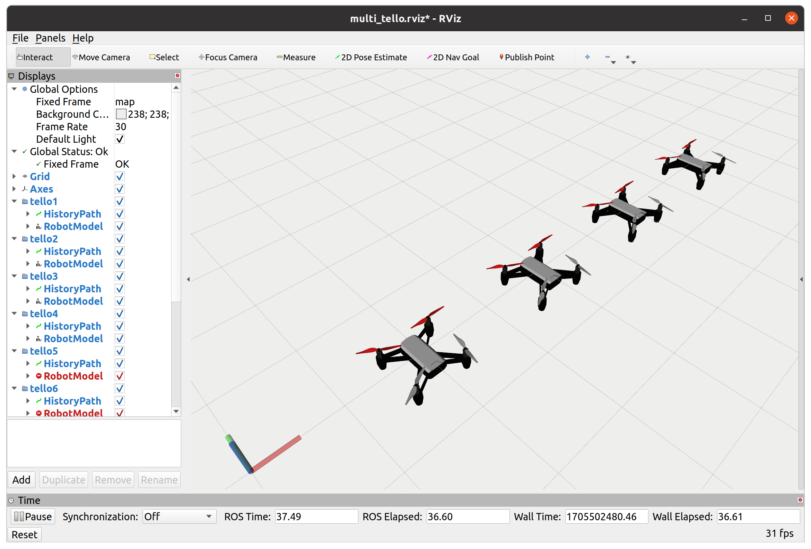

## swarm_sync_sim

### Introduction
swarm_sync_sim is a synchronized (lock-stepped) numerical simulation platform for multi-robot swarm system based on ROS. It provides a **lightweight** (low cpu consumption), **scalable** (multiple seperate nodes) and **fast** (10x acceleration) simulation engine for various kinds of robots including quadrotors, unmannded ground vehicles (UGV), fixed-wing UAVs, and customized models. It is suitable for simulating motion planning and control algorithms of multi-robot systems based on ROS, while the code can be directly used in real experiments without any modification.


### Installation

```bash
# Dependencies
sudo apt install ros-noetic-mavros ros-noetic-mavros-extras ros-noetic-robot-state-publisher -y
pip3 install PyQt5

# Build
git clone https://gitee.com/bhswift/swarm_sync_sim.git
cd swarm_sync_sim/
catkin_make
echo "source $PWD/devel/setup.bash" >> ~/.bashrc
```

### Usage

#### PX4 Rotor Simulation

Launch px4 rotor simulation nodes (mavros + px4 stil + quadrotor dynamics + visualization):

```bash
### 1. Launch sim clock
# You can also specify max_simulation_rate and auto_start in the launch file
roslaunch sss_sim_env sim_clock.launch max_speed_ratio:=1 auto_start:=true

### 2. Launch multiple mavros-px4-rotor sim nodes
# Specify initial positions in the launch file
roslaunch px4_rotor_sim multi_px4_rotor_sim.launch
```


To control the simulation clock:

```bash
# @param proceed: true(go on), false(stop)
# @param max_sim_speed: 0.0(keep unchanged)
rosservice call /sss_clock_control "proceed: true
max_sim_speed: 0.0"
```

Then you can launch your control algorithm nodes to communicate with the mavros topics and services.

Some useful commands:

```bash
### Arm UAV1
rosservice call /uav1/mavros/cmd/arming "value: true" 

### Send position setpoints to UAV1
rostopic pub /uav1/mavros/setpoint_raw/local mavros_msgs/PositionTarget "header:
  seq: 0
  stamp: {secs: 0, nsecs: 0}
  frame_id: ''
coordinate_frame: 1
type_mask: 0b110111111000
position: {x: 0.0, y: 1.0, z: 2.0}
velocity: {x: 0.0, y: 0.0, z: 0.0}
acceleration_or_force: {x: 0.0, y: 0.0, z: 0.0}
yaw: 0.0
yaw_rate: 0.0" -r 10

### Switch UAV1 into offboard mode:
rosservice call /uav1/mavros/set_mode "base_mode: 0 
custom_mode: 'OFFBOARD'"
```

By the way, **it is highly recommended to launch the simulation by** [minigc](https://gitee.com/bhswift/minigc.git), which is a multi-UAV ground control UI.


#### Tello Drone Simulation

Tello is an educational drone developed by DJI. The [tello_driver](http://wiki.ros.org/tello_driver) has made it possible to control multiple tello drones by ROS topics. This part simulates the tello dynamics and the tello_driver ROS interface.

```bash
### 1. Launch sim clock
# You can also specify max_simulation_rate and auto_start in the launch file
roslaunch sss_sim_env sim_clock.launch max_speed_ratio:=1 auto_start:=true 

### 2. Launch multiple tello sim nodes
# Specify initial poses in the launch file
roslaunch tello_sim multi_tello_sim.launch
```



To control the simulation clock:

```bash
# @param proceed: true(go on), false(stop)
# @param max_sim_speed: 0.0(keep unchanged) 10 (max 10 simulation acceleration)
rosservice call /sss_clock_control "proceed: true
max_sim_speed: 10.0" 
```

Then you can launch your control algorithm nodes to communicate with the tello ROS topics and services.

Some useful commands:

```bash
### tello1 takeoff/land
rostopic pub /tello1/takeoff std_msgs/Empty "{}"
rostopic pub /tello1/land std_msgs/Empty "{}"

### Send velocity setpoints to tello1
# The cmd is not real velocity commands but stick inputs. To simulate the transformation from stick commands to velocity setpoints, adjust the scale factor'linear_vel_scale' and 'angular_vel_scale' in tello_sim_single.launch
# linear.x : [-2, 2] body right.
# linear.y : [-2, 2] body front.
# linear.z : [-2, 2] up
# angular.z : [-2, 2] rotate to right
rostopic pub /tello1/cmd_vel geometry_msgs/Twist "linear:
  x: 0.1
  y: 0.0
  z: 0.0
angular:
  x: 0.0
  y: 0.0
  z: 0.0" -r 10

### Read Imu data (orientation relative to the initial heading)
rostopic echo /tello1/imu

### Read pose (orientation either from ground truth or imu depending on 'use_imu_orientation' parameter in tello_sim_single.launch)
rostopic echo /tello1/pose
```


### Advanced

1.  xxxx
2.  xxxx
3.  xxxx


### Contributions

This project is developed by Peixuan Shu from December 2023.
