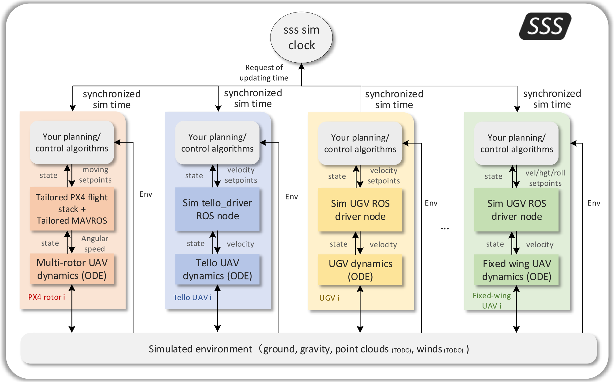
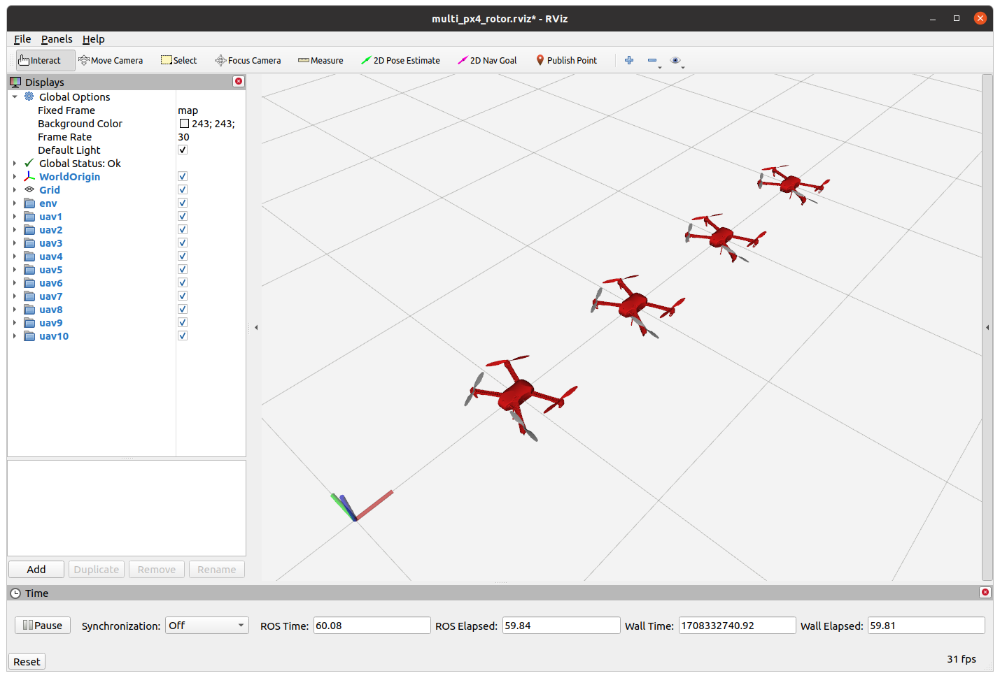
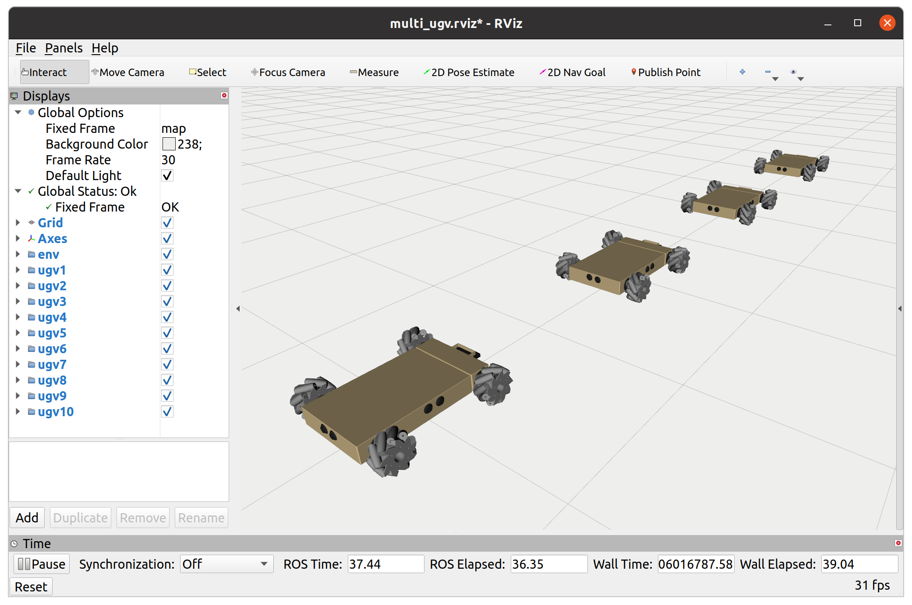
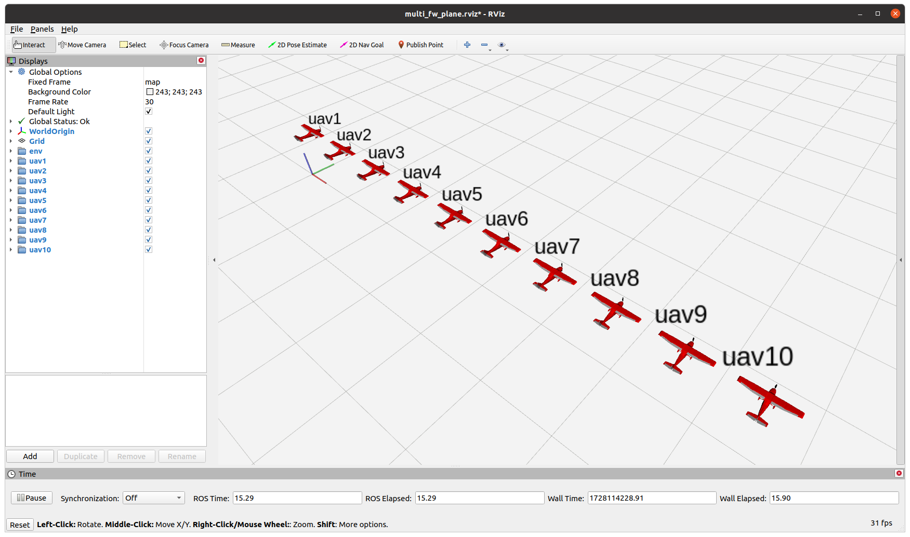

## swarm_sync_sim 

### Introduction
swarm_sync_sim is a synchronized (lock-stepped) numerical simulation platform for multi-robot swarm systems based on ROS. It provides a **lightweight** (low cpu consumption), **scalable** (multiple separate nodes) and **fast** (10x acceleration) engine for simulating various kinds of robots including quadrotors, unmannded ground vehicles (UGV), fixed-wing UAVs, and customized models. It is suitable for simulating motion planning and control algorithms of multi-robot systems based on ROS, while the code can be directly used in real experiments with only slight modifications.



### Installation

```bash
# Dependencies
sudo apt install ros-noetic-mavros ros-noetic-mavros-extras ros-noetic-robot-state-publisher -y
pip3 install PyQt5

# Build
git clone https://gitee.com/bhswift/swarm_sync_sim.git
cd swarm_sync_sim/
catkin_make
echo "source $PWD/devel/setup.bash" >> ~/.bashrc
```

### Usage

#### Sim Clock

A simulation clock is designed to govern the simulation time for all ROS nodes and publish `/clock`. Every ROS nodes register to the sim_clock and request time updates when they sleeps. The sim_clock is designed to synchronize the time (lock steps) for all nodes by updating the clock time only if all clients have new time updating requests. To realize this synchronized clock mechanism, these steps must be followed:

##### 1. Clock side

```bash
### 1. Launch sim clock
# You can also specify max_simulation_rate and auto_start in the launch file
roslaunch sss_sim_env sim_clock.launch max_speed_ratio:=1 auto_start:=true
```

To control the simulation clock:

```bash
# @param proceed: true(go on), false(stop)
# @param max_sim_speed: 0.0 (keep unchanged)
rosservice call /sss_clock_control "proceed: true
max_sim_speed: 0.0"
```

You can also tune the clock by the UI interface developed by PyQt5:


##### 2. ROS node side

If a ROS node needs the clock to wait until it finishes executing a piece of code (usually a loop), then it should register to the sim_clock first and request the clock update every time it completes a loop or sleeps at one thread. Fortunately, this process is encapsulated by this project. What you need to do is just **replacing the ROS time related APIs with those provided by this project.**

For cpp ROS nodes:

```cpp
#include <sss_sim_env/sss_utils.hpp>

/* substitute nh::createTimer() with sss_utils::createTimer() */
ros::NodeHandle nh;
sss_utils::Timer timer
timer = sss_utils::createTimer(nh, ros::Duration(0.1), &YourClass::cb_timer, this); // create a ROS timer with 0.1s period and cb_timer callback

/* substitute ros::Duration().sleep() with sss_utils::Duration(0.2).sleep() */
sss_utils::Duration(0.2).sleep(); // sleep for 0.2s ROS time

/* substitute ros::Rate with sss_utils::Rate */
sss_utils::Rate loop_rate(10);
loop_rate.sleep(); // sleep for 10Hz in a loop
```

For python nodes: TODO.

It is noted that these sss_utils APIs are equal to the original ROS APIs if the ROS parameter `/use_sss_sim_time` and `/use_sim_time` is false. So **switching between the simulation and real experiment can be easily realized by modifying the launch file**:

```xml
<launch>
    <param name="/use_sim_time" value="true"/> <!-- use sss sim time -->
    <param name="/use_sss_sim_time" value="true"/> <!-- use sss sim time -->
    
    <param name="/use_sim_time" value="false"/>  <!-- use original ROS time -->
    <param name="/use_sss_sim_time" value="false"/> <!-- use original ROS time -->
   
    <node ... />
</launch>
```

**It is noted that for those ROS nodes that have not used sss_utils APIs, the simulation time still works** if these nodes use ros::Time rather than the system time as the simulation clock time is natively supported by ROS. But in this case, the simulation clock will not wait these nodes for completing their loops (not synchronized). This may cause some loops to be skipped especially when the simulation is accelerated.

We have developd some ROS sim nodes using sss_utils to accelerate the simulation:

#### PX4 Rotor Simulation

We rewrite the mavros and px4 core modules (based on px4 v1.13.3) to adapt to this simulation platform and provide the acceleration capacity. Launch px4 rotor simulation nodes (mavros + px4 stil + quadrotor dynamics + visualization):

```bash
### 1. Launch sim clock
roslaunch sss_sim_env sim_clock.launch max_speed_ratio:=1 auto_start:=true

### 2. Launch multiple mavros-px4-rotor sim nodes (Specify initial positions in the launch file)
roslaunch px4_rotor_sim multi_px4_rotor_sim.launch
```
Or you can simply use the wallclock time without acceleration:

```bash
roslaunch px4_rotor_sim multi_px4_rotor_sim.launch use_sim_time:=false
```



The drone head is on the side with red propellers.

Then you can launch your control algorithm nodes to communicate with the mavros topics and services.

Some useful commands:

```bash
### [First Step] Arm UAV1
rosservice call /uav1/mavros/cmd/arming "value: true" 

### [Second Step] Keep sending position setpoints to UAV1
rostopic pub /uav1/mavros/setpoint_raw/local mavros_msgs/PositionTarget "header:
  seq: 0
  stamp: {secs: 0, nsecs: 0}
  frame_id: ''
coordinate_frame: 1
type_mask: 0b110111111000
position: {x: 0.0, y: 1.0, z: 2.0}
velocity: {x: 0.0, y: 0.0, z: 0.0}
acceleration_or_force: {x: 0.0, y: 0.0, z: 0.0}
yaw: 0.0
yaw_rate: 0.0" -r 10

### [Third Step] In anthor terminal, switch UAV1 into offboard mode:
rosservice call /uav1/mavros/set_mode "base_mode: 0 
custom_mode: 'OFFBOARD'"
```

By the way, **it is highly recommended to launch the simulation by** [minigc](https://gitee.com/bhswift/minigc.git), which is a multi-UAV ground control UI.

For drone visualization in real experiments:

```bash
roslaunch px4_rotor_sim drone_visualizer_multi.launch
```


#### Tello Drone Simulation

Tello is an educational drone developed by DJI. The [tello_driver](http://wiki.ros.org/tello_driver) has made it possible to control multiple tello drones by ROS topics. This part simulates the tello dynamics and the tello_driver ROS interface.

```bash
### 1. Launch sim clock
roslaunch sss_sim_env sim_clock.launch max_speed_ratio:=1 auto_start:=true 

### 2. Launch multiple tello sim nodes (Specify initial poses in the launch file)
roslaunch tello_sim multi_tello_sim.launch
```

Or you can simply use the wallclock time without acceleration:

```bash
roslaunch tello_sim multi_tello_sim.launch use_sim_time:=false
```


Then you can launch your control algorithm nodes to communicate with the tello ROS topics and services.

Some useful commands:

```bash
### tello1 takeoff/land
rostopic pub /tello1/takeoff std_msgs/Empty "{}"
rostopic pub /tello1/land std_msgs/Empty "{}"

### Send velocity setpoints to tello1
# The cmd is not real velocity commands but stick inputs. To simulate the transformation from stick commands to velocity setpoints, adjust the scale factor'linear_vel_scale' and 'angular_vel_scale' in tello_sim_single.launch
# linear.x : [-2, 2] body right.
# linear.y : [-2, 2] body front.
# linear.z : [-2, 2] up
# angular.z : [-2, 2] rotate to right
rostopic pub /tello1/cmd_vel geometry_msgs/Twist "linear:
  x: 0.1
  y: 0.0
  z: 0.0
angular:
  x: 0.0
  y: 0.0
  z: 0.0" -r 10

### Read Imu data (orientation relative to the initial heading)
rostopic echo /tello1/imu

### Read pose (orientation either from ground truth or imu depending on 'use_imu_orientation' parameter in tello_sim_single.launch)
rostopic echo /tello1/pose
```

For tello visualization in real experiments:

```bash
roslaunch tello_sim visualize_tello_multi.launch
```


#### UGV simulation

For UGVs with an onboard comupter that receives velocity commands and publishes imu states,  this part simulates the UGV ROS driver and dynamics. Mecanum / Unicycle / Ackermann UGVs are supported.

```bash
### 1. Launch sim clock
roslaunch sss_sim_env sim_clock.launch max_speed_ratio:=1 auto_start:=true 

### 2. Launch multiple ugv sim nodes (Specify initial poses, ugv types in the launch file)
roslaunch ugv_sim multi_ugv_sim.launch
```

Or you can simply use the wallclock time without acceleration:

```bash
roslaunch ugv_sim multi_ugv_sim.launch use_sim_time:=false
```



Then you can launch your control algorithm nodes to communicate with the ugv ROS topics and services.

Some useful commands:

```bash
### send velocity commands to UGV1
rostopic pub /ugv1/cmd_vel geometry_msgs/Twist "linear:
  x: 0.1 # body front (m/s)
  y: 0.0 # body left (m/s) only for Mecanum UGV
  z: 0.0
angular:
  x: 0.0
  y: 0.0
  z: 0.0" # rotation to left (rad/s)

### Read Imu data (orientation relative to the magnetic East)
rostopic echo /ugv1/imu

### Read pose (orientation either from ground truth or imu depending on 'use_imu_orientation' parameter in ugv_sim_single.launch)
rostopic echo /ugv1/pose

### Read twist (simulates the mocap twist)
rostopic echo /ugv1/twist
```

For ugv visualization in real experiments:

```bash
roslaunch ugv_sim visualize_ugv_multi.launch
```

#### Fixed-wing UAV Simulation

We offer a  simulation library for fixed-wing UAVs with autopilots which receives onboard ROS setpoint commands (Roll, height, and airspeed). Launch fixed-wing UAV simulation nodes (ROS driver + UAV with autopilot simulation library + visualization):

```bash
### 1. Launch sim clock
roslaunch sss_sim_env sim_clock.launch max_speed_ratio:=1 auto_start:=true

### 2. Launch multiple fixed-wing UAV simulation nodes (Specify initial positions in the launch file)
roslaunch fw_plane_sim multi_fw_sim.launch
```

Or you can simply use the wallclock time without acceleration, **although it is not recommended because the  time of the UAVs may not be synchronized**:

```bash
roslaunch fw_plane_sim multi_fw_sim.launch use_sim_time:=false
```



Then you can launch your control algorithm nodes with the ROS topics and services.

Some useful commands:

```bash
### sending position setpoints to UAV1
rostopic pub /uav1/cmd_vel geometry_msgs/Twist "linear:
  x: 25.0 # airspeed setpoint (m/s)
  y: 20.0 # height setpoint (m)
  z: 30.0 # roll setpoint (m)
angular:
  x: 0.0
  y: 1.0 # target mode (1 for offboard control)
  z: 0.0" -r 10
```

It is noted that the ROS topics states follow the NED (for local states) and FRD (for body states) coordinates.

For fixed-wing UAV visualization in real experiments:

```bash
roslaunch fw_plane_sim fw_plane_visualizer_single.launch
```

### Acknowledgement

This project has been developed and maintained by Dr Peixuan Shu (shupeixuan@qq.com) since December 2023.
